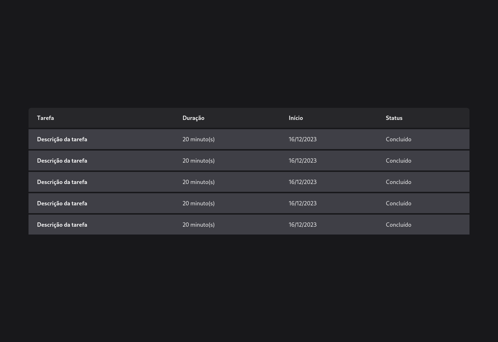
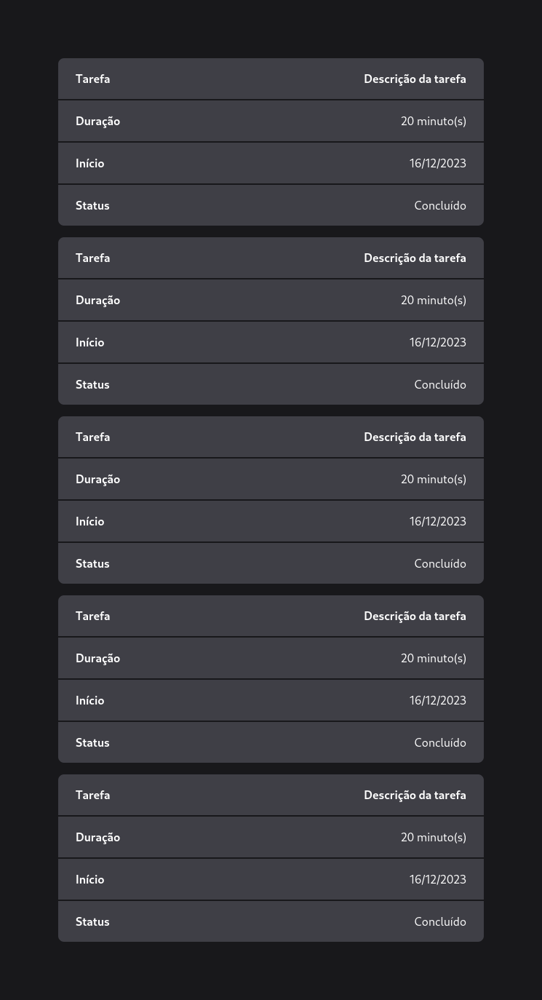

# Tabela Responsiva com Vite e Tailwind CSS

Este é um projeto de exemplo que demonstra a criação de uma tabela responsiva utilizando Vite e Tailwind CSS. Esta tabela é projetada para se adaptar a diferentes tamanhos de tela, oferecendo uma experiência consistente em dispositivos móveis e desktop.

## Tecnologias Utilizadas

- [Vite](https://vitejs.dev/): Um construtor de aplicativos web rápido e moderno para desenvolvimento em tempo real.
- [Tailwind CSS](https://tailwindcss.com/): Um framework CSS utilitário para construção de designs customizados.

## Funcionalidades

- Tabela responsiva que se ajusta a diferentes tamanhos de tela.
- Visual limpo e legível em dispositivos móveis e desktop.
- **Adicione printscreens dos resultados do projeto aqui:**

  
  
  

## Como Usar

1. Clone este repositório:

   ```bash
   git clone https://github.com/gildembergleite/responsive-table-tailwind.git
   ```

2. Instale as dependências:

   ```bash
   cd responsive-table-tailwind
   npm install
   ```

3. Execute o servidor de desenvolvimento:

   ```bash
   npm run dev
   ```

   Isso iniciará o servidor de desenvolvimento. Abra o navegador e visite `http://localhost:5173` para visualizar a tabela responsiva.

## Contribuindo

Sinta-se à vontade para contribuir com novos recursos, correções de bugs ou melhorias. Abra um PR (pull request) com suas alterações, e ficaremos felizes em revisar e mesclar.

## Licença

Este projeto está licenciado sob a [MIT License](LICENSE).